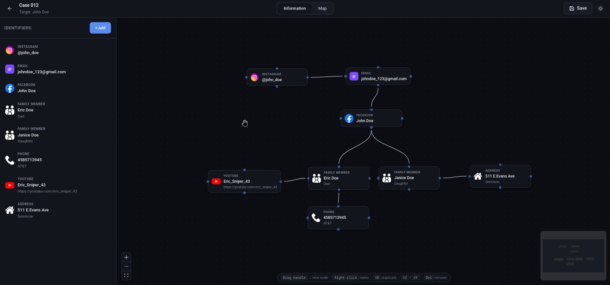
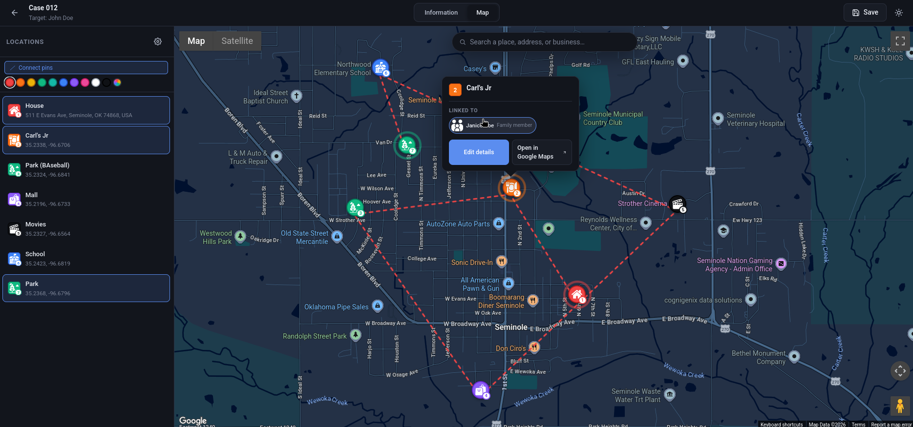

<div align="center">

# Omega OSINT ⚛

Una pequeña aplicación web para organizar investigaciones OSINT. Anota identificadores (perfiles sociales, teléfonos, vehículos, lo que sea), marca lugares en un mapa (Google u OpenStreetMap) y conéctalos entre sí. Nada sale de tu navegador.

[](https://react.dev)
[](https://vitejs.dev)
[](LICENSE)
[](#privacidad)

</div>

---

## Introducción
### ¿Cómo funciona Omega OSINT?

La **pestaña Información** es un grafo de nodos. Cada nodo es una pieza de información: una cuenta de Instagram, un número de teléfono, una matrícula, un familiar. Arrastra un conector hacia otro nodo para unirlos. Suelta el conector en un espacio vacío para crear un nodo nuevo ya conectado (estilo Blender); el clic derecho hace lo mismo sin arrastrar. Cada tipo tiene sus propios campos de formulario y un icono de marca, y también puedes subir tus propios iconos.

La **pestaña Mapa** funciona con clic para marcar. Coloca una marca en cualquier sitio y, si el lugar es reconocido por el geocodificador (una cafetería, una escuela, un parque), el nombre, la dirección y un icono adecuado se rellenan por ti. Hay una barra de búsqueda para saltar a un lugar por su nombre. Las marcas pueden vincularse a identificadores, así una marca de cafetería puede llevar "etiquetado aquí por @juanperez el 14 de marzo" con la cuenta de Instagram correspondiente adjunta. Elige **Google Maps** (datos de lugares más ricos, requiere clave de API) u **OpenStreetMap** (sin clave, sin registro) desde el icono de ajustes.

Todo se guarda en un único archivo `.osint.json` que puedes almacenar donde quieras, compartir o versionar.

## Capturas




<br>

<h2 align="center"> 🛠 Tecnologías </h2>

<div align="center">

|Componente |Herramienta |
|:---|:---|
| Interfaz | React 18, Vite |
| Grafo de nodos | [`@xyflow/react`](https://reactflow.dev) |
| Mapas | [`@vis.gl/react-google-maps`](https://visgl.github.io/react-google-maps/), [`leaflet`](https://leafletjs.com) + [`react-leaflet`](https://react-leaflet.js.org) |
| Estado | React Context (sin Redux / sin librerías de store) |
| Almacenamiento | Archivos JSON locales (proyectos) + `localStorage` (ajustes, iconos personalizados) |

</div>

<br>

<h2 align="center"> 🚀 Primeros pasos </h2>

Necesitas Node 18+ y npm.

```bash
git clone https://github.com/anonymousRAID/OSINT-Mapping-Tool
cd OSINT-Mapping-Tool
npm install
npm run dev
```

Luego abre <http://localhost:5173>.

Para generar un paquete de producción:

```bash
npm run build       # escribe en ./dist
npm run preview     # sirve ./dist en el puerto 4173
```

<br>

## Configurar Google Maps (opcional)

Solo lo necesitas si quieres el modo Google Maps. Si prefieres saltarte Google Cloud por completo, ve a [modo OpenStreetMap](#modo-openstreetmap). Tu clave vive solo en tu navegador y nunca se sube ni se envía a ningún otro sitio.

En la Consola de Google Cloud, elige o crea un proyecto y:

1. En **APIs y servicios → Biblioteca**, activa **Maps JavaScript API**, **Geocoding API** y **Places API**. Maps JS es obligatoria; las otras dos habilitan el autorrelleno de direcciones y la detección de tipos de lugar.
2. En **APIs y servicios → Credenciales**, crea una clave de API.
3. En esa clave, configura **Restricciones de aplicación → Referentes HTTP** y añade `http://localhost:5173/*` para desarrollo. Esto es lo único que mantiene la clave a salvo si alguna vez se filtra.
4. Opcional: crea un **Map ID** en Gestión de mapas → Estilos de mapa para estilos personalizados. Sin uno verás un aviso en la consola pero la app sigue funcionando.

Dos formas de proporcionar la clave a la app:

**En la app:** Pégala en la pantalla de configuración de la pestaña Mapa y pulsa Guardar. Se guarda en `localStorage`. Si ya continuaste sin una, el icono de ajustes de la parte superior izquierda abre los mismos ajustes.

**Archivo de configuración:** Copia la plantilla:

```bash
cp public/app.config.example.json public/app.config.json
```

Luego rellena tus valores:

```json
{
  "googleMaps": {
    "apiKey": "AIzaSyD…",
    "mapId": "abc123def456…"
  }
}
```

`public/app.config.json` está en gitignore, así que aunque hagas push no se filtrará.

Si ambos están definidos, `localStorage` tiene prioridad. Bórralo desde el icono de ajustes para volver al archivo.

## Modo OpenStreetMap

¿No te apetece lidiar con Google Cloud? Abre los ajustes de la pestaña Mapa (icono de ajustes) y cambia el proveedor a **OpenStreetMap**. Las teselas vienen de openstreetmap.org y la búsqueda/geocodificación inversa se hace con Nominatim. Sin clave, sin registro, y tu vista se mantiene al cambiar de pestaña. La detección de lugares es más burda que la de Google, y la tarjeta de información por marca no tiene detalles de lugar en vivo (valoración, horarios, etc.) — todo lo demás funciona igual.

## Guardar, abrir y la lista de "Continuar recientes"

Pulsa **Guardar** arriba a la derecha y el proyecto se descarga como `<nombre>.osint.json`. Pulsa **Abrir proyecto** en la pantalla de inicio para volver a cargarlo. El formato es JSON plano con una versión de esquema, así que los archivos antiguos siguen cargándose tras las actualizaciones.

Mientras trabajas, la app también toma una instantánea periódica en `localStorage`. Si pulsas sin querer la flecha de retroceso sin guardar (a mí me ha pasado más de una vez), el proyecto aparece en "Continuar recientes" en la pantalla de inicio con una insignia de "sin guardar". Selecciónalo y vuelves donde estabas. Se conservan hasta 5 proyectos recientes por navegador.

`.osint.json` también está en gitignore, así que dejar uno en la carpeta del repo no acabará en los commits.

## Funciones en detalle

### Pestaña Información

Veinte tipos de identificador integrados en las categorías Redes sociales, Contacto, Personal, Vehículo y Otros, cada uno con sus propios campos tipados (Instagram: usuario, seguidores, publicaciones, biografía; Vehículo: marca, modelo, año, color, titular; etc.).

Conexiones:
- Arrastra un conector de un nodo a otro para unirlos.
- Arrastra a un espacio vacío para obtener un menú de creación rápida (esto también crea automáticamente el enlace al nuevo nodo).
- Haz clic derecho en el lienzo para el mismo menú sin el enlace.

Iconos:
- Iconos de marca para plataformas comunes (Instagram, Facebook, X/Twitter, YouTube, TikTok, LinkedIn, Snapchat, Discord, Telegram, Google, Spotify, WhatsApp).
- Sube los tuyos. Se guardan por navegador, así que están disponibles en todos los proyectos de la misma instalación.

Atajos de edición (desactivados cuando escribes en un campo o hay un modal abierto):
- `Ctrl/Cmd + Z` deshacer, `Ctrl/Cmd + Shift + Z` o `Ctrl/Cmd + Y` rehacer. Hasta 20 acciones, guardadas en memoria.
- `Ctrl/Cmd + C / V` para copiar/pegar los nodos seleccionados.
- `Ctrl/Cmd + D` para duplicar.
- `Supr` o `Retroceso` quita la selección (un nodo o una conexión).

Selección múltiple con un recuadro o `Shift+clic`. Cualquier acción sobre una selección múltiple cuenta como un solo paso de deshacer.

### Pestaña Mapa

Haz clic en cualquier sitio para colocar una marca. Si el lugar es conocido — un POI de Google en modo Google, un resultado de Nominatim en modo OSM — el nombre, la dirección y un icono adecuado se rellenan. Si no, obtienes las coordenadas y rellenas el resto.

Diez iconos de lugar integrados (cafetería, comida, gimnasio, casa, cine, parque, parque de atracciones, escuela, centro comercial, ropa, biblioteca) con variantes clara y oscura que cambian con el tema. El icono y el color son personalizables por marca.

Al hacer clic en una marca se abre una tarjeta con tus notas (fecha de visita, con quién estaba, notas libres), los identificadores vinculados a ella y un enlace al mapa en vivo. En modo Google la tarjeta también muestra los detalles de lugar que Google tenga registrados (valoración, horarios, teléfono, sitio web).

Un interruptor "Conectar puntos" en la barra lateral dibuja una línea discontinua entre las marcas en el orden en que se colocaron. El color de la línea es personalizable.

### Enlace cruzado entre las dos pestañas

Las marcas pueden vincularse a uno o varios identificadores, cada enlace con una nota corta ("check-in en IG", "titular registrado", "dirección anterior"). Haz clic en una etiqueta de identificador en la tarjeta de una marca para saltar a la pestaña Información con ese nodo resaltado. Pasa el ratón sobre un identificador en la barra lateral de la pestaña Información y las marcas vinculadas a él parpadean en el mapa.

## Estructura del proyecto

```
src/
  components/                 Componentes de UI (pestañas, modales, selectores)
  context/                    ProjectContext, NodeHistoryContext, NavigationContext, …
  images/
    icons/                    iconos de marca por tipo de lugar (claro + oscuro)
    node_icons/               iconos de marca para identificadores
  styles/                     CSS global + de temas
  utils/                      projectIO, customIcons, appConfig, recentProjects
  identifierTypes.js          registro de tipos de identificador + resolvers
  identifierIcons.js          registro de iconos de marca de identificadores
  mapIcons.js                 registro de iconos por tipo de lugar + mapeo de tipos de Google
  pinColors.js                paleta de colores de marcas
  App.jsx                     puerta entre inicio ↔ vista de proyecto
  main.jsx                    pila de proveedores + render raíz
public/
  app.config.example.json     plantilla para tu clave de API (versionada)
  app.config.json             tu clave real (en gitignore)
```

## Privacidad

No hay backend ni analíticas. En modo Google las únicas llamadas salientes son las peticiones de teselas/Places API que el navegador hace con tu propia clave. En modo OpenStreetMap van a openstreetmap.org para las teselas y a nominatim.openstreetmap.org para la búsqueda — las mismas peticiones que harías usando sus sitios directamente.

Tus ajustes y tu biblioteca de iconos personalizados viven en `localStorage` de este navegador. Los archivos de proyecto (`*.osint.json`) viven en el disco donde los guardaste. Para borrar todo, limpia los datos del sitio del origen en el que lo ejecutas y elimina los archivos `.osint.json`.

El `.gitignore` del repo mantiene `app.config.json` y `*.osint.json` fuera de los commits, así que trabajar por accidente dentro de la carpeta clonada no filtrará tu clave ni tu investigación.

## Licencia

[GPL-3.0](LICENSE).

## Contribuir

Los PR son bienvenidos. La única regla estricta es: no añadas nada que envíe datos fuera de la máquina del usuario. Sin analíticas, sin sincronización remota, sin rastreo de terceros. Si no estás seguro de si algo cruza esa línea, abre primero una issue.

<br>
<div text-align="left">
  <p>
    
    &nbsp;&nbsp;&nbsp;0x59bFD011AaAeA85AF644A574a11836673CAcfCD4
  </p>
  <p>
    
    &nbsp;&nbsp;LYxKNT7TAWZAM96Vz2HRxyUmvZbqEqiofe
  </p>
</div>
